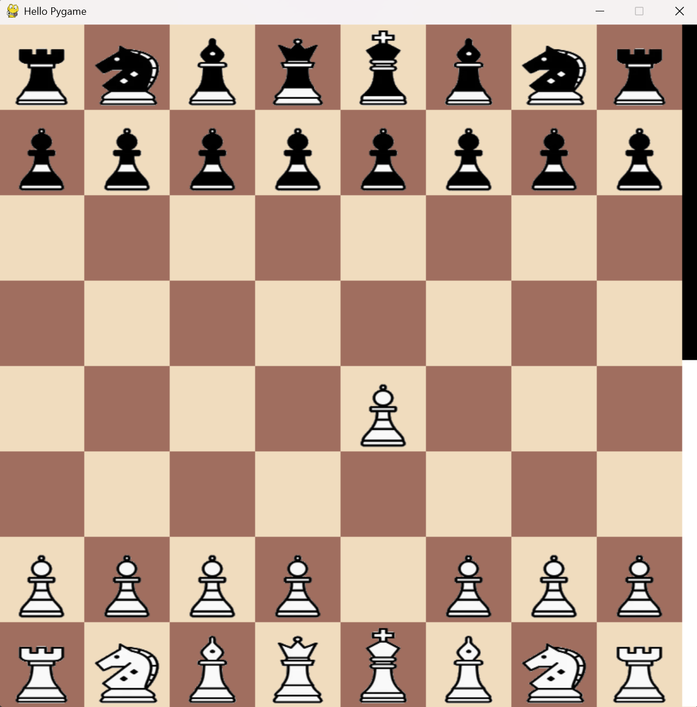

.. Programmierung DSKI - Schachengine documentation master file, created by
   sphinx-quickstart on Sun Apr 27 10:19:29 2025.
   You can adapt this file completely to your liking, but it should at least
   contain the root `toctree` directive.

Programmierung DSKI - Schachengine documentation
================================================

Herzlich Willkommen zu ihrem Studium an der Hochschule Düsseldorf. In diesem Kurs sollen sollen Sie die Grundlagen 
der Programmierung in Python erlernen mit einem speziellen Fokus auf Data Science und Künstliche Intelligenz. Im Rahmen ihrer 
verpflichtenden Prüfungsleistung programmieren Sie dabei eine erste, eigene KI die in der Lage sein wird, Schach zu spielen. 

.. toctree::
   :maxdepth: 2
   :caption: Contents:

   Das Schachspiel <chessoverview>
   Über Schachcomputer <chessengine>
   Das Brett <board>
   Die Figuren <figures>
   Die Engine <engine>
   Eine sinnvolle Reihenfolge <reihenfolge>
   Einrichten der Arbeitsumgebung <setup>