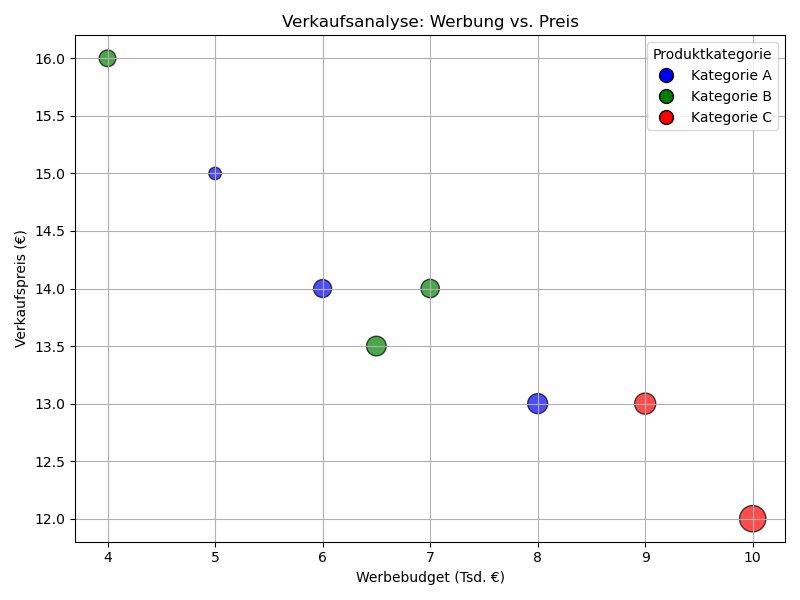

# 🎨  Diagrammtypen I – Linien, Punkte, Balken

## 📈 Liniendiagramm – `plt.plot()`
```python
import matplotlib.pyplot as plt

x = [1, 2, 3, 4, 5]
y = [2, 3, 5, 7, 11]

plt.plot(x, y)
plt.title("Liniendiagramm")
plt.show()
```
➡️ Gut für Trends, Zeitverläufe, kontinuierliche Werte

## 🔘 2. Punktdiagramm – `plt.scatter()` - Scatter Plot mit Farbe, Größe & Legende
🎯 Szenario:
Du willst untersuchen, wie Werbebudget und Produktpreis den Verkaufserfolg (Anzahl Verkäufe) beeinflussen.
Dargestellt wird:

* x-Achse = Werbebudget (in Tsd. €)
* y-Achse = Preis (in €)
* Punktgröße = Verkaufsmenge
* Punktfarbe = Produktkategorie

➡️ Gut für Beziehungen zwischen Werten, z. B. Korrelationen

```python
import matplotlib.pyplot as plt
import numpy as np

# Daten
werbung = [5, 7, 8, 4, 6, 9, 10, 6.5]
preis = [15, 14, 13, 16, 14, 13, 12, 13.5]
verkaeufe = [100, 220, 260, 180, 210, 290, 450, 250]  # bestimmt die Punktgröße
kategorie = ["A", "B", "A", "B", "A", "C", "C", "B"]

# Farben zuweisen
farben_map = {"A": "blue", "B": "green", "C": "red"}
farben = [farben_map[k] for k in kategorie]

# Punktgrößen skalieren
sizes = [v * 0.8 for v in verkaeufe]

# Scatter Plot
plt.figure(figsize=(8, 6))
scatter = plt.scatter(werbung, preis, s=sizes, c=farben, alpha=0.7, edgecolors="black")

plt.xlabel("Werbebudget (Tsd. €)")
plt.ylabel("Verkaufspreis (€)")
plt.title("Verkaufsanalyse: Werbung vs. Preis")

# Legende manuell erzeugen
from matplotlib.lines import Line2D
legende = [Line2D([0], [0], marker='o', color='w', label='Kategorie A',
                  markerfacecolor='blue', markersize=10, markeredgecolor='black'),
           Line2D([0], [0], marker='o', color='w', label='Kategorie B',
                  markerfacecolor='green', markersize=10, markeredgecolor='black'),
           Line2D([0], [0], marker='o', color='w', label='Kategorie C',
                  markerfacecolor='red', markersize=10, markeredgecolor='black')]

plt.legend(handles=legende, title="Produktkategorie")
plt.grid(True)
plt.tight_layout()
plt.show()
```



### 📊 Interpretation:
Jeder Punkt ist ein Produkt

Je größer der Punkt, desto mehr wurde verkauft

Farben zeigen Produktkategorie

Man erkennt auf einen Blick, in welchem Preisbereich Werbung effektiv ist

### ✅ Techniken in diesem Plot:
Feature | Methode
| - | -
Punktgröße | `s=...` (skaliert mit Verkäufen)
Punktfarbe | `c=...` mit Farbliste
Transparenz | `alpha=...`
Legende manuell | `Line2D(...), plt.legend(...)`
Kategoriefarben | via Mapping `{"A": "blue", ...}`
Gitterlinien | `plt.grid(True)`

## 📊 Balkendiagramm – plt.bar() und plt.barh()
```python
produkte = ["A", "B", "C"]
verkaeufe = [100, 80, 120]

plt.bar(produkte, verkaufe)
plt.title("Produktverkäufe")
plt.ylabel("Stückzahl")
plt.show()
```
➡️ Vertikale Balken → gut für Vergleiche zwischen Kategorien

🔁 Horizontal:
```python
plt.barh(produkte, verkaufe)
plt.title("Produktverkäufe (horizontal)")
plt.xlabel("Stückzahl")
plt.show()
```

## 🎨 4. Farben, Marker, Linienstile
```python
plt.plot(x, y, color="green", linestyle="--", marker="o")
```

| Element | Beispiele
| - | - 
Farbe | "red", "green", "#0044cc"
Linienstil | "-" (durchgezogen), "--" (gestrichelt), ":" (gepunktet)
Marker | "o" (Kreis), "s" (Quadrat), "^" (Dreieck), "x"

➡️ Mehr Übersicht: [hier](https://matplotlib.org/stable/gallery/lines_bars_and_markers/)

## ✅ Zusammenfassung

| Diagrammtyp | Funktion | Methode
| - | - | -
Linie | Zeitverlauf | plt.plot()
Punktwolke | Beziehung x/y-Werte | plt.scatter()
Balkendiagramm | Kategorievergleich | plt.bar()
Horizontalbalken | Kategorievergleich | plt.barh()

## ✍️ Übung: Vergleich zweier Produktverkäufe
Wir wollen die Verkäufe verschiedener Produkte über mehrere Monate hinweg visualisieren
* Produktnamen: `["Produkt A", "Produkt B", "Produkt C"]`

* Verkäufe im Januar: `[120, 90, 60]`

* Verkäufe im Februar: `[100, 110, 80]`

* Erstelle ein Balkendiagramm, das beide Monate vergleicht (nebeneinander)

* Erstelle ein Liniendiagramm, das die Entwicklung jedes Produkts zeigt

* Füge Titel, Achsenbeschriftungen und Legenden hinzu

## ✅ Beispiel-Lösung (Balkendiagramm):
```{admonition} 💡 Lösung anzeigen
:class: dropdown

```python
import numpy as np
produkte = ["Produkt A", "Produkt B", "Produkt C"]
jan = [120, 90, 60]
feb = [100, 110, 80]

x = np.arange(len(produkte))  # Positionen auf X-Achse

plt.bar(x - 0.2, jan, width=0.4, label="Januar", color="skyblue")
plt.bar(x + 0.2, feb, width=0.4, label="Februar", color="orange")

plt.xticks(x, produkte)
plt.title("Produktverkäufe Januar vs. Februar")
plt.ylabel("Stückzahl")
plt.legend()
plt.tight_layout()
plt.show()
```

## ✅ Beispiel-Lösung (Liniendiagramm):
```{admonition} 💡 Lösung anzeigen
:class: dropdown

```python
plt.plot(produkte, jan, marker="o", label="Januar", linestyle="-")
plt.plot(produkte, feb, marker="s", label="Februar", linestyle="--")

plt.title("Verkaufsentwicklung")
plt.ylabel("Stückzahl")
plt.legend()
plt.tight_layout()
plt.show()
```