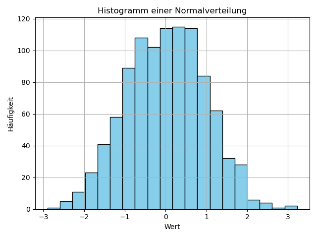
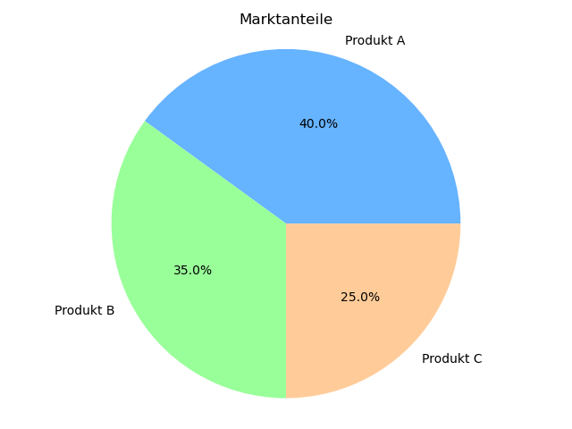

# 🎨 Diagrammtypen II – Histogramm, Boxplot & Torte

## 📊 Histogramm – `plt.hist()`
Ein Histogramm zeigt, wie oft ein bestimmter Wertebereich vorkommt. Ideal zur Verteilungsanalyse.

```python
import matplotlib.pyplot as plt
import numpy as np

daten = np.random.normal(loc=0, scale=1, size=1000)

plt.hist(daten, bins=20, color="skyblue", edgecolor="black")
plt.title("Histogramm einer Normalverteilung")
plt.xlabel("Wert")
plt.ylabel("Häufigkeit")
plt.grid(True)
plt.tight_layout()
plt.show()
```



Parameter | Bedeutung
| - | -
bins | Anzahl der Klassen / Balken
color | Farbe der Balken
edgecolor | Farbe der Ränder


## 📦 Boxplot – `plt.boxplot()`
Zeigt Median, Quartile und Ausreißer einer Verteilung:

```python
werte = np.stack([
    np.random.normal(100, 20, 200),
    np.random.normal(80, 15, 200),
    np.random.normal(120, 30, 200),
], axis=1)


plt.boxplot(werte, vert=True, patch_artist=True)
plt.title("Boxplot Beispiel")
plt.xlabel("Wert")
plt.grid(True)
plt.tight_layout()
plt.show()
```


➡️ Ideal zur Darstellung zentraler Tendenz + Streuung in wenigen Zahlen

## 🍰 Kreisdiagramm – `plt.pie()`
```python
labels = ["Produkt A", "Produkt B", "Produkt C"]
werte = [40, 35, 25]

plt.pie(werte, labels=labels, autopct="%1.1f%%", colors=["#66b3ff", "#99ff99", "#ffcc99"])
plt.title("Marktanteile")
plt.axis("equal")  # sorgt für runde Torte
plt.tight_layout()
plt.show()
```



| Parameter | Bedeutung
| - | - 
autopct | Prozentanzeige im Diagramm
labels | Beschriftung der Segmente
colors | Farbschema
axis('equal') | Kreis statt Ellipse

## ✅ Zusammenfassung
Diagrammtyp | Methode | Zweck
| - | - | - 
Histogramm | `plt.hist()` | Verteilung / Häufigkeit
Boxplot | `plt.boxplot()` | Median, Streuung, Ausreißer
Kreisdiagramm | `plt.pie()` | prozentuale Aufteilung / Anteile
